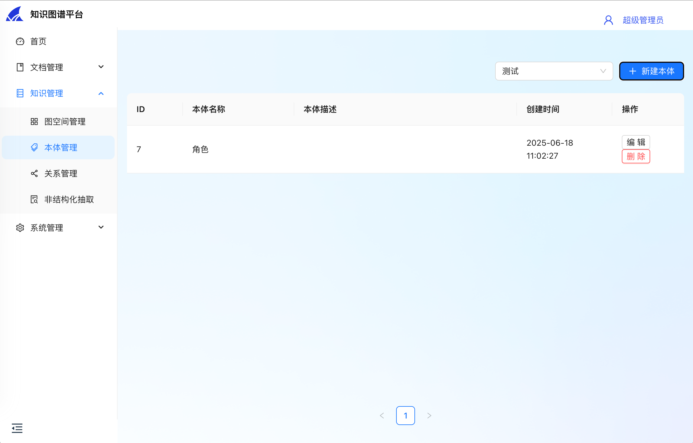

# DeepKG

English | [简体中文](README_zh.md)

DeepKG is a LLM-powered multi-modal knowledge graph platform, designed to facilitate the construction, management, and inference of knowledge graphs.

## Screenshots

| Features                | Screenshots                                           |
|-------------------------|-------------------------------------------------------|
| Directories             |       |
| Documents               |        |
| Workspaces              |   |
| Ontologies              |        |
| Relations               |    |
| unstructured extraction |  |
| Organizations           |    |
| Users                   |            |

## Dependencies

- Go 1.20
- Node.js
- pnpm
- Docker

## Install
```shell
# 1. deploy database with docker
cd admin/deploy
docker compose -f docker-compose.yml up -d

# 2. deploy nebula with docker
cd nebula
docker compose -f docker-compose-lite.yml up -d

# 3. initialize database
cd ../../
make init_ddl

# 4. start backend server
make run

# 5. install frontend dependencies
cd ../deepkg-fe
make install

# 6. start frontend server
make run
```

## Contributors

- [@SnakeHacker](https://github.com/SnakeHacker)
- [@IsshikiSenn](https://github.com/IsshikiSenn)
- [@chenmiao8563](https://github.com/chenmiao8563)
- [@wuwuwukai](https://github.com/wuwuwukai)

## TODO
- [x] 系统架构设计、中间件选型
- [ ] 用户账号、组织、角色、菜单、鉴权体系构建
    - [x] 用户增删改查: Mickey
    - [x] 组织增删改查: 腾博
    - [ ] 角色增删改查
    - [ ] 菜单增删改查
    - [ ] 鉴权体系构建
- [ ] Nebula集成
    - [x] Nebula部署
    - [ ] Nebula接口验证: 陈淼
- [ ] 基于非结构化数据的图谱构建
- [ ] 知识图谱实体融合、消歧
- [ ] 图谱发布
- [ ] 基于图谱的推理
- [ ] 多模态知识图谱构建
- [ ] 基于多模态知识图谱的推理
- [ ] API文档: 吴凯
