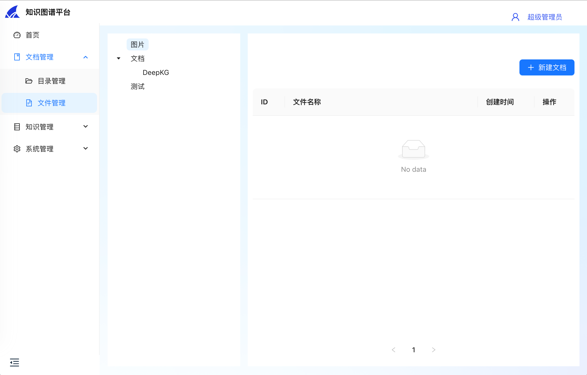
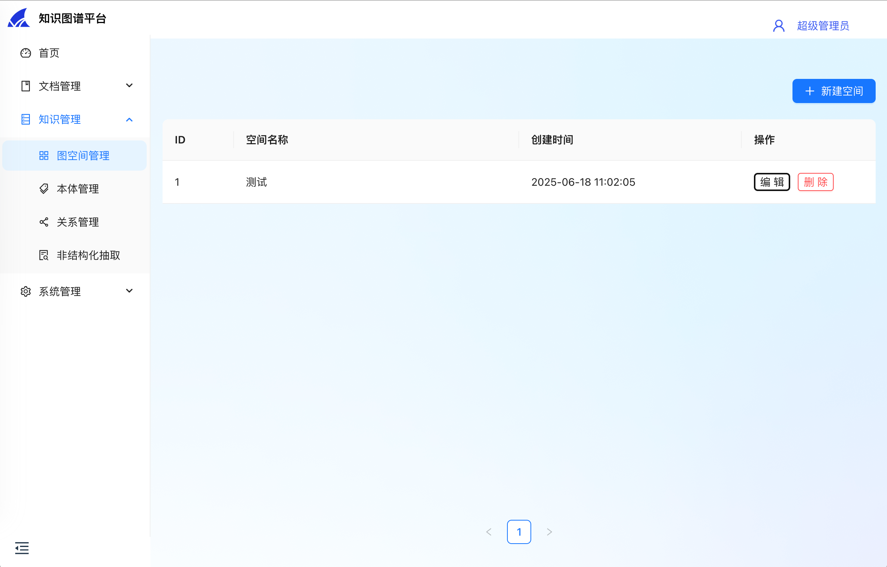
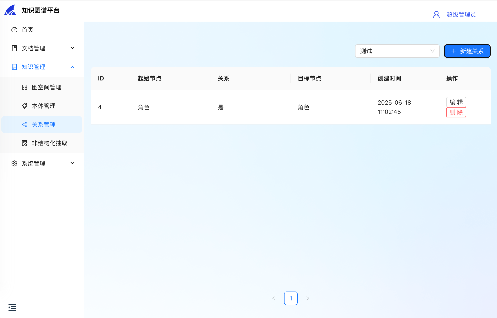

# DeepKG

English | [简体中文](README_zh.md)

DeepKG is a LLM-powered multi-modal knowledge graph platform, designed to facilitate the construction, management, and inference of knowledge graphs.

## Demonstration

| Directories                                      | Documents                                       | Workspaces                                           |
|--------------------------------------------------|-------------------------------------------------|------------------------------------------------------|
|  |  |  |

| Ontologies                                      | Relations                                           | Unstructured Extraction                               |
|-------------------------------------------------|-----------------------------------------------------|-------------------------------------------------------|
|  |  |  |

| Organizations                                       | Users                                       |
|-----------------------------------------------------|---------------------------------------------|
|  |  |

## Sequence Diagram


## Dependencies

- Go 1.20
- Node.js
- pnpm
- Docker

## Install
```shell
# 1. deploy database with docker
cd admin/deploy
docker compose -f docker-compose.yml up -d

# 2. deploy nebula with docker
cd nebula
docker compose -f docker-compose-lite.yml up -d

# 3. initialize database
cd ../../
make init_ddl

# 4. start backend server
make run

# 5. install frontend dependencies
cd ../deepkg-fe
make install

# 6. start frontend server
make run
```

## Contributors

- [@SnakeHacker](https://github.com/SnakeHacker)
- [@IsshikiSenn](https://github.com/IsshikiSenn)
- [@chenmiao8563](https://github.com/chenmiao8563)
- [@wuwuwukai](https://github.com/wuwuwukai)
