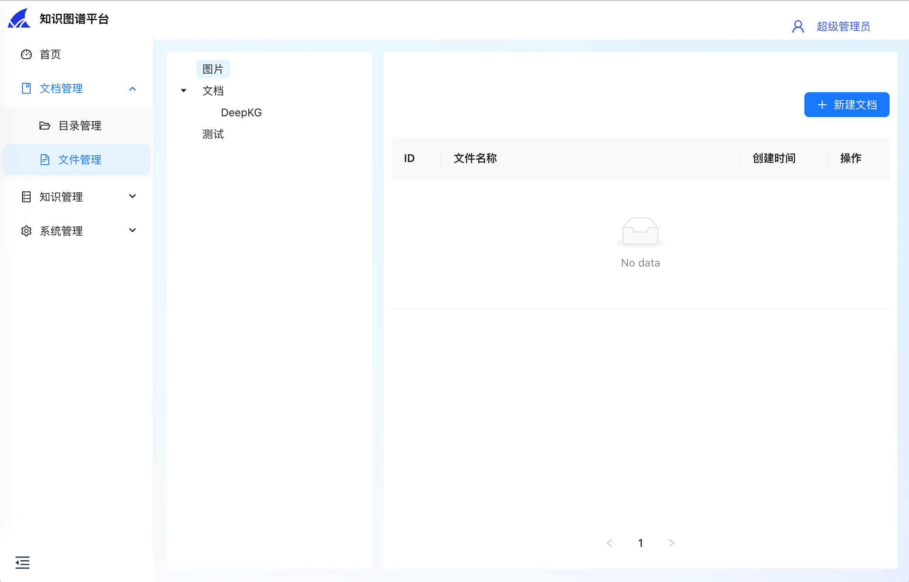
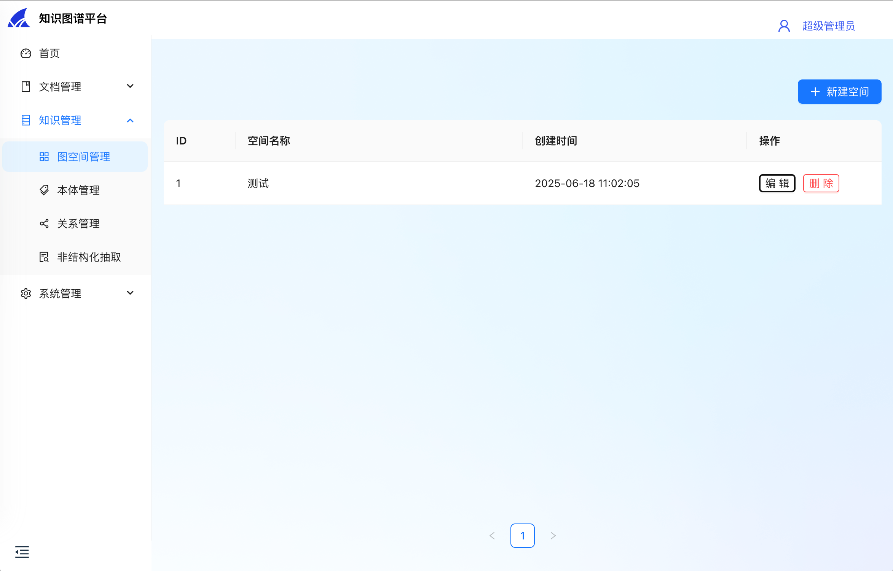
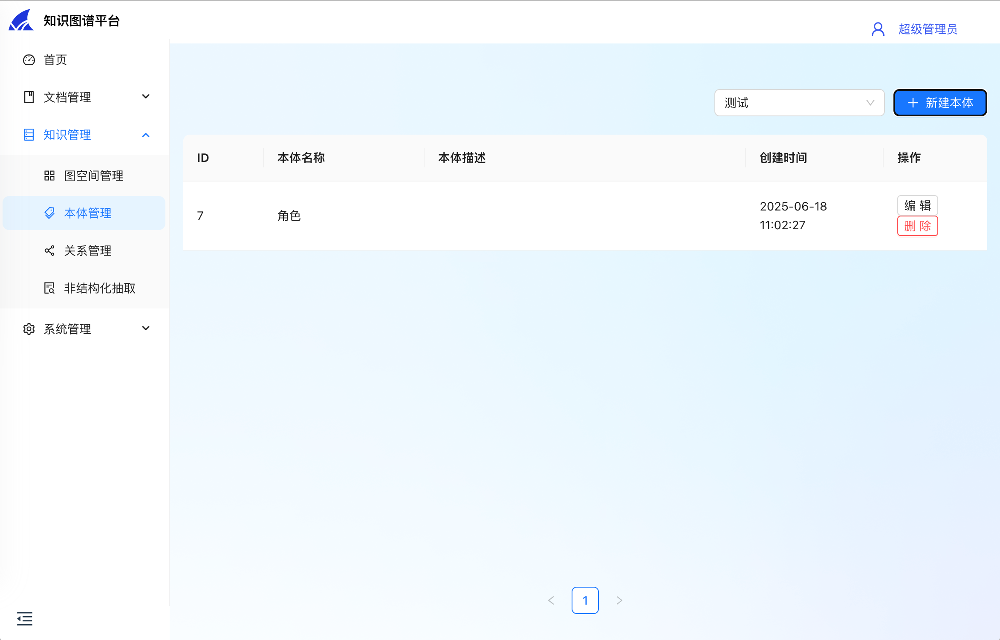
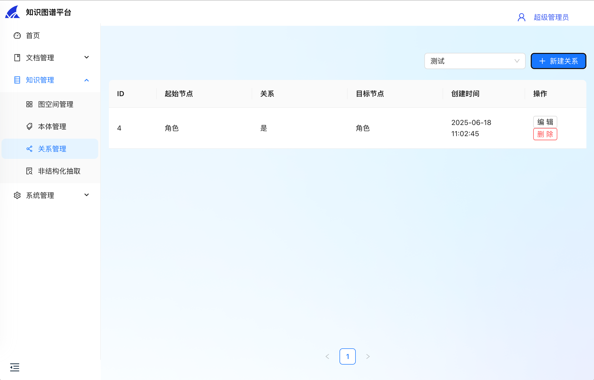
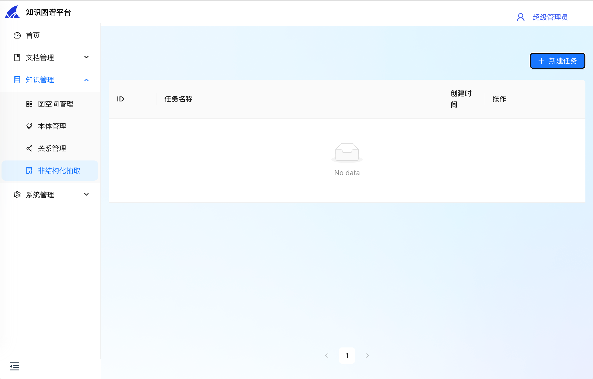
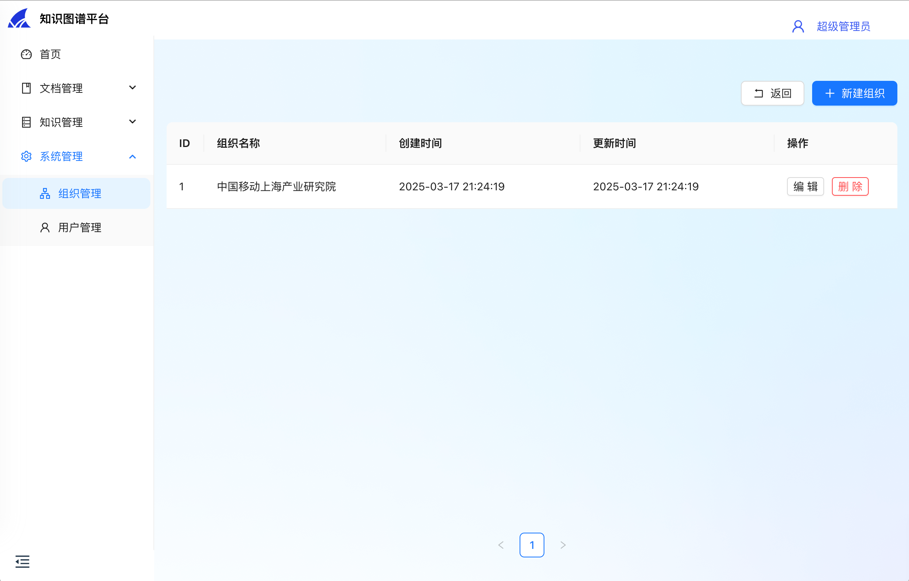
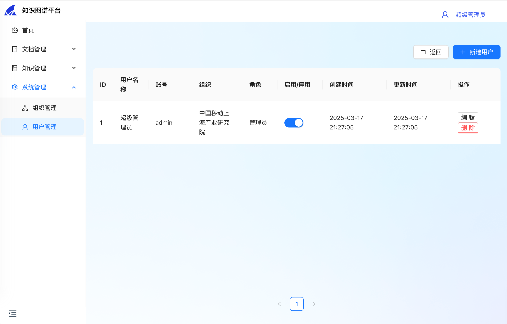

# DeepKG

[English](README.md) | 简体中文

DeepKG是一个基于大模型的多模态知识图谱平台，旨在简化知识图谱的构建、管理和推理过程。

## 系统展示

|                  功能                   |                                          截图                                           |
|:-------------------------------------:|:-------------------------------------------------------------------------------------:|
|  <div style="width: 60pt">目录管理</div>  |   <div style="width: 250pt"></div>    |
|  <div style="width: 60pt">文件管理</div>  |    <div style="width: 250pt"></div>    |
| <div style="width: 60pt">图空间管理</div>  | <div style="width: 250pt"></div>  |
|  <div style="width: 60pt">本体管理</div>  |    <div style="width: 250pt"></div>    |
|  <div style="width: 60pt">关系管理</div>  |  <div style="width: 250pt"></div>  |
| <div style="width: 60pt">非结构化抽取</div> | <div style="width: 250pt"></div> |
|  <div style="width: 60pt">组织管理</div>  |  <div style="width: 250pt"></div>  |
|  <div style="width: 60pt">用户管理</div>  |      <div style="width: 250pt"></div>      |

## 依赖

- Go 1.20
- Node.js
- pnpm
- Docker

## 安装
```shell
# 1. 使用Docker部署数据库等服务
cd admin/deploy
docker compose -f docker-compose.yml up -d

# 2. 使用Docker部署Nebula
cd nebula
docker compose -f docker-compose-lite.yml up -d

# 3. 初始化数据库
cd ../../
make init_ddl

# 4. 启动后端服务
make run

# 5. 安装前端依赖
cd ../deepkg-fe
make install

# 6. 启动前端服务
make run
```

## 贡献者

- [@SnakeHacker](https://github.com/SnakeHacker)
- [@IsshikiSenn](https://github.com/IsshikiSenn)
- [@chenmiao8563](https://github.com/chenmiao8563)
- [@wuwuwukai](https://github.com/wuwuwukai)

## TODO
- [x] 系统架构设计、中间件选型
- [ ] 用户账号、组织、角色、菜单、鉴权体系构建
    - [x] 用户增删改查: Mickey
    - [x] 组织增删改查: 腾博
    - [ ] 角色增删改查
    - [ ] 菜单增删改查
    - [ ] 鉴权体系构建
- [ ] Nebula集成
    - [x] Nebula部署
    - [ ] Nebula接口验证: 陈淼
- [ ] 基于非结构化数据的图谱构建
- [ ] 知识图谱实体融合、消歧
- [ ] 图谱发布
- [ ] 基于图谱的推理
- [ ] 多模态知识图谱构建
- [ ] 基于多模态知识图谱的推理
- [ ] API文档: 吴凯
