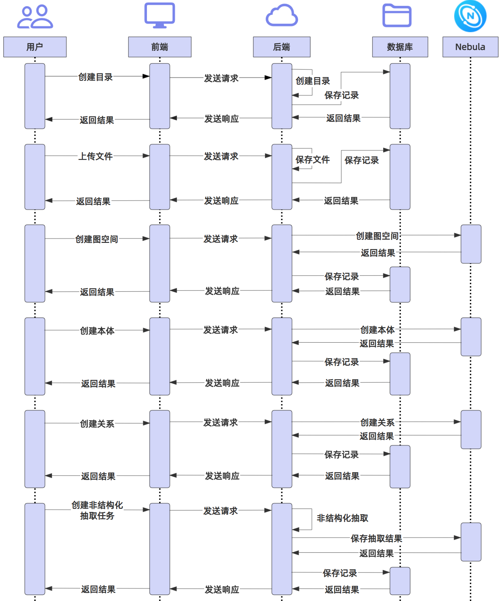

# DeepKG

[English](README.md) | 简体中文

DeepKG是一个基于大模型的多模态知识图谱平台，旨在简化知识图谱的构建、管理和推理过程。

## 系统展示

| 目录管理 | 文件管理 | 图空间管理 |
| --- | --- | --- |
|  |  |  |

| 本体管理 | 关系管理 | 非结构化抽取 |
| --- | --- | --- |
|  | |  |

| 组织管理 | 用户管理 |
| --- | --- |
|  |  |

## 时序图



## 依赖

- Go 1.20
- Node.js
- pnpm
- Docker

## 安装
```shell
# 1. 使用Docker部署数据库等服务
cd admin/deploy
docker compose -f docker-compose.yml up -d

# 2. 使用Docker部署Nebula
cd nebula
docker compose -f docker-compose-lite.yml up -d

# 3. 初始化数据库
cd ../../
make init_ddl

# 4. 启动后端服务
make run

# 5. 安装前端依赖
cd ../deepkg-fe
make install

# 6. 启动前端服务
make run
```

## 贡献者

- [@SnakeHacker](https://github.com/SnakeHacker)
- [@IsshikiSenn](https://github.com/IsshikiSenn)
- [@chenmiao8563](https://github.com/chenmiao8563)
- [@wuwuwukai](https://github.com/wuwuwukai)
